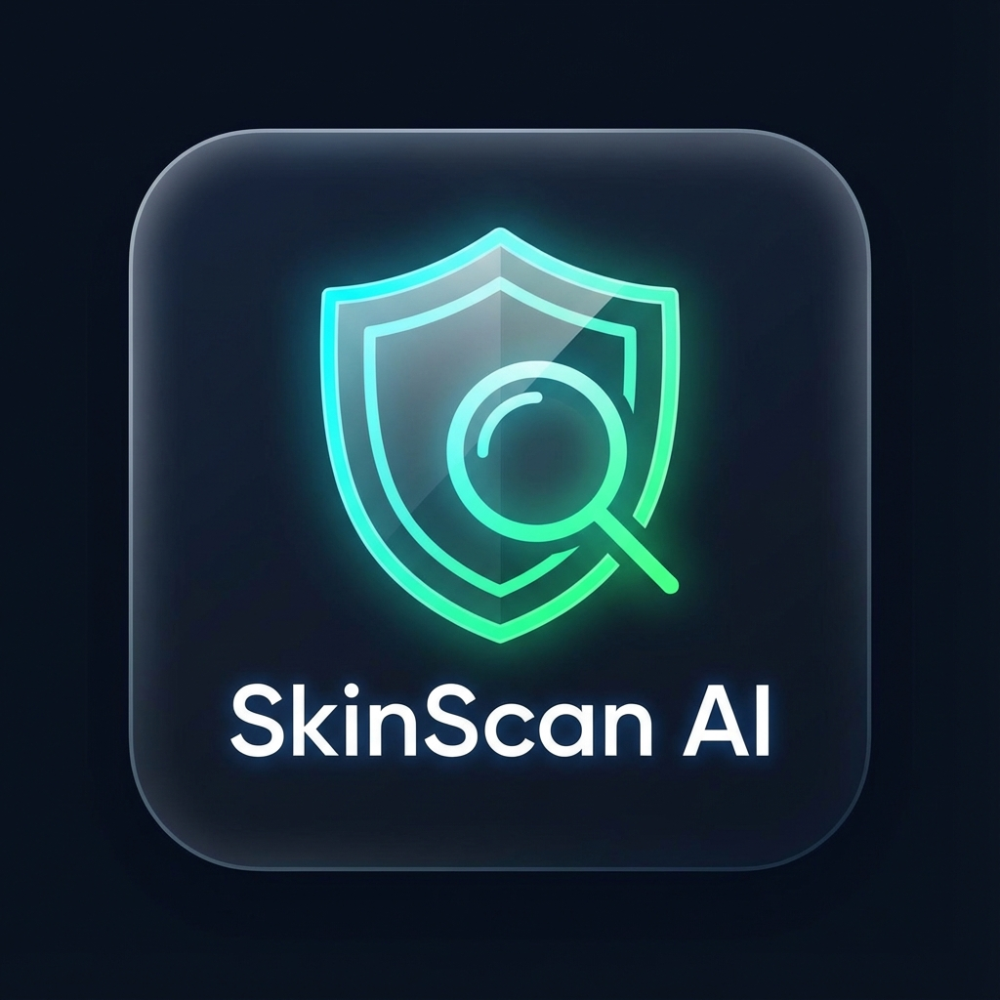

# 🩺 SkinScan AI

**AI-Powered Skin Cancer Detection for Mobile & Web**

SkinScan AI is a modern, mobile-first web application that uses deep learning (MobileNetV2) to analyze skin lesions and assess whether they are potentially **benign** or **malignant**.



## ✨ Features
*   **🤖 AI Analysis**: Instant classification using a trained MobileNetV2 model.
*   **📱 Mobile-First Design**: Fully responsive dark-themed UI that feels like a native app.
*   **✂️ Interactive Crop**: Zoom and crop your image before analysis for better accuracy.
*   **🔆 Image Enhancement**: Adjust brightness and contrast of your photo.
*   **💾 History**: Automatically saves your recent scan results.
*   **📥 PWA Ready**: Installable on Android and iOS home screens.
*   **🔒 Secure Tunneling**: Includes built-in Ngrok support for easy HTTPS mobile access.

## 🚀 Installation

1.  **Prerequisites**: Python 3.8+ installed.
2.  **Clone/Download** this repository.
3.  **Install Dependencies**:
    ```bash
    pip install -r requirements.txt
    ```

## 🏃‍♂️ How to Run

### 1. Start the Web Server
Open a terminal in the project folder and run:
```bash
python app.py
```
*   The app will run locally at `http://localhost:5000`.

### 2. Connect Your Phone (HTTPS)
To use the **camera** and **install the app** on your phone, you need a secure HTTPS connection. We've included a helper script for this.

1.  Make sure the Flask server (`python app.py`) is running.
2.  Open a **new** terminal window.
3.  Run:
    ```bash
    python run_ngrok.py
    ```
4.  Copy the URL : `https://overlogical-wenona-unstriped.ngrok-free.dev/` and open it on your phone.

## 🧠 How It Works
*   The **Backend** is built with **Flask** and **TensorFlow**. It loads a trained model (`skin_cancer_model.h5`).
*   The **Frontend** is pure HTML/CSS/JS (no heavy frameworks).
*   For a deep dive into the AI training process, read [AI_EXPLANATION.md](AI_EXPLANATION.md).

## ⚠️ Medical Disclaimer
**This tool is for educational purposes only.**
It is NOT a medical diagnosis tool. The AI can make mistakes.
Always consult a certified dermatologist for any skin concerns. Early detection by a professional saves lives.

---
*Created with ❤️ by Antigravity*
